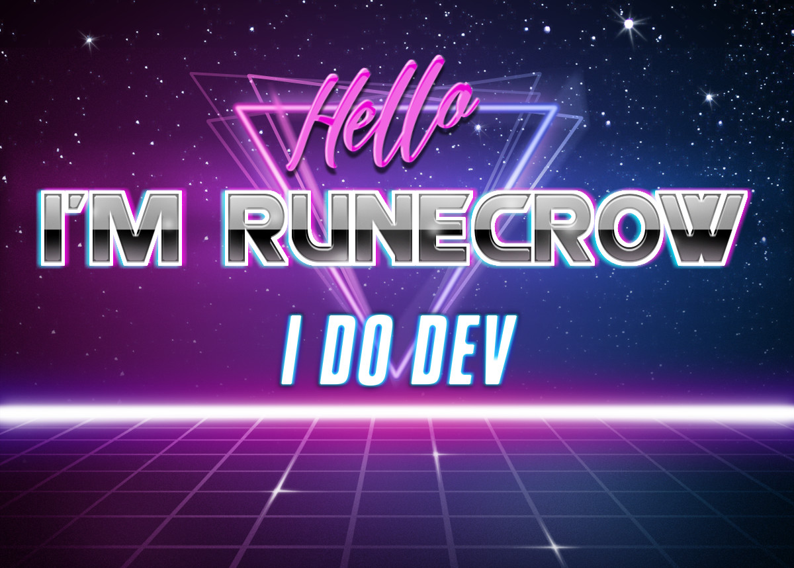

Here are some ideas to get you started:

- 🔭 I’m currently working as Unity dev at CyberGames! I also program in my off time! My current project is Unity Runtime Terrain Editor and UI Scaler

- 🌱 At this time i'm learning about parael computing using compute shaders! Also classic cool looking shaders!
- 👯 I’m looking to collaborate on ...
- 🤔 I’m looking for help with ...
- 💬 Ask me about my fascination with voxel and rtx graphics
- 📫 How to reach me: 
    - My email: hierodrimm@gmail.com
    - My discord: HyeroDrimm💻#6477
- 😄 Pronouns: @/*
- ⚡ Fun fact: Sleep is a vital process used for your body to heal its phisical and psychical damage, that saied I am in constant pain 😃

